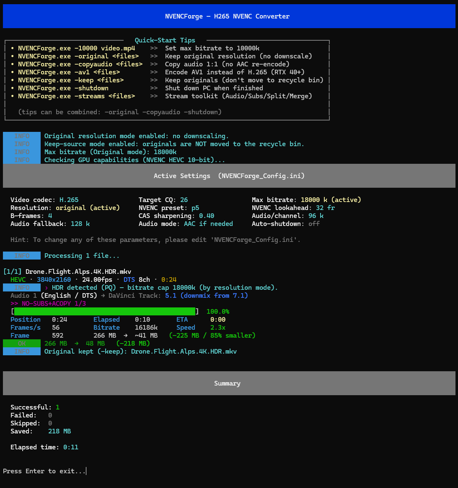

<div align="center">

# 🎬 NVENCForge

### Drop a video, get it back smaller: quality-tuned GPU encoding, drag-and-drop.

**H.265 / AV1 NVENC batch encoder + complete stream toolkit for Windows.**
HDR-aware. Resilient. DaVinci-Resolve-ready. One EXE.

*Powered by FFmpeg, which does the actual encoding. NVENCForge is the automation, validation and safety layer around it.*

[](#-requirements)
[](#-requirements)
[](#-av1-mode-ready-for-the-future)
[](#-building-from-source)
[](#-license)

**[⬇️ Download the latest release](https://github.com/burnersen/NVENCForge/releases/latest)** · **[☕ Buy me a coffee](https://ko-fi.com/T5G0219GA6)**



</div>

---

## ⚡ 30 seconds, no manual

1. Download `NVENCForge.exe`, a single file with nothing to install.
2. Drag a video (or a whole folder) onto it.
3. Done. Your video is now H.265, smaller, and the original sits safely in the recycle bin.

On first run NVENCForge fetches FFmpeg automatically: no setup, no PATH fiddling, no dependencies.

**Some real numbers** from 12 mixed 4K HDR test files on an RTX 5070 Ti, run with `-original -copyaudio` (original 4K resolution kept, audio copied 1:1, so every saved megabyte comes from the video encode alone):

| Source | Before | After | Saved |
|---|---|---|---|
| 400 Mbit/s HEVC 4K demo | 1 435 MB | 65 MB | **−96 %** |
| HDR10+ / Dolby Vision sample | 510 MB | 107 MB | **−79 %** |
| DTS:X IMAX 4K clip | 383 MB | 129 MB | **−66 %** |
| **Whole batch (12 files)** | **5.4 GB** | **0.9 GB** | **−4 481 MB in 2:58 min** |

A reality check on these figures: the −96 % case is a best case, a short clip with an absurdly high source bitrate, and most of that saving comes from the source being wildly inefficient, not from magic. Typical, already-compressed material shrinks far less, and some files get skipped or remuxed entirely because re-encoding wouldn't help. That skip logic is a feature, not a shortcoming. The encoder is CQ-based (constant quality) in every mode: the size shrinks to whatever the chosen quality level needs. In the default mode (no flags) material above 1080p is also downscaled to 1080p.

> **A word of honesty:** NVENCForge re-encodes, and re-encoding is lossy. It shines on bulky, already-compressed or inefficient files where the space saving is worth a quality hit you won't notice in normal playback. It is **not** an archival tool: keep untouched masters of anything irreplaceable. Originals go to the recycle bin (recoverable), not a permanent delete, but treat that as a safety net, not a backup.

---

## ✨ What NVENCForge does

- 🧠 **Smart, not brute-force.** Probes every file first: already-efficient videos are remuxed or skipped instead of re-encoded. Bitrate targets derive from the source, with no fixed-bitrate butchering.
- 🌈 **HDR-aware.** HDR10 (PQ) and HLG are detected. The color tags (transfer, primaries, BT.2020, range) are copied straight from the source, never fabricated. In `-original` mode (no rescale) the static HDR10 mastering-display / MaxCLL metadata rides through as well. When downscaling to 1080p (the default mode) the output stays correctly HDR-tagged (PQ / BT.2020, not washed out), but the static mastering metadata may not survive every FFmpeg build. NVENCForge deliberately never synthesizes HDR metadata values, because a fabricated value is exactly what has broken HDR conversions in the past.
- 🛡️ **Safe with your files.** Originals go to the **recycle bin** only after the output is probed and validated, never hard-deleted. Existing files are never overwritten (automatic numbered names). Abort mid-encode? You keep a playable `.preview.mkv`.
- 🚦 **Resilient by design.** Per-file locks, stall watchdog (kills frozen FFmpeg after 5 min), bounded memory, multi-stage fallback cascade (subs → no subs → AAC → video-only) so one broken stream doesn't take down the whole batch.
- 👯 **Parallel out of the box.** Start the same command in two terminals; instances lock files individually and split the work automatically.
- 🎛️ **DaVinci-Resolve-safe audio.** DTS, TrueHD, EAC3, FLAC, Opus & >5.1 layouts are converted to AAC that Resolve actually imports (≤5.1, ≤48 kHz), or kept 1:1 with `-copyaudio`.
- 🔁 **Ships with its own source.** The EXE carries its own source code (Go `embed`) and extracts it on first run: the source it was built from is right there inside the binary.
- 🌍 **Unicode-safe filename cleanup.** `Movie (2016) [BluRay] x264.mkv` → `Movie.2016.h265.mkv`. Every script in the world survives, release-group noise doesn't.

---

## 🚀 Usage

```
NVENCForge.exe [flags] [files/folders]
NVENCForge.exe -streams [files]
```

| Flag | Effect |
|---|---|
| *(none)* | Convert every supported video in the current folder |
| `-NNNN` | Max target bitrate in kbps (e.g. `-10000`) |
| `-orig` / `-original` | Keep original resolution (no 1080p downscale), raised bitrate cap |
| `-copyaudio` / `-ca` | Copy all audio 1:1, no AAC re-encode |
| `-av1` | Encode **AV1** instead of H.265 (RTX 40+) → `.av1.mkv` |
| `-keep` | Keep the originals: don't move them to the recycle bin after a successful convert |
| `-shutdown` | Shut the PC down 30 s after the batch finishes |
| `-streams` | Stream toolkit (split / extract / merge); must be the first argument |

Flags combine freely: `NVENCForge.exe -av1 -original -copyaudio -shutdown Movie.mkv`

Supported input: `mp4 mkv ts avi mov flv wmv webm m4v mts m2ts`

### 💡 Pro tip: put NVENCForge into your right-click "Send to" menu

This is my personal workflow: pure drag & drop, no command line. Everyone has their own way; this one has served me well:

1. Keep `NVENCForge.exe` in a folder where you have **write access** (e.g. `Documents\NVENCForge`, *not* `C:\Program Files`; the tool is portable, needs no admin rights and keeps its config right next to the EXE).
2. Press `Win+R`, type `shell:sendto`, press Enter, and your "Send to" folder opens.
3. Create shortcuts to `NVENCForge.exe` in there, one per favorite mode, numbered so they sort nicely. Append the arguments at the end of the *Target* field (shortcut → Properties):

   | Shortcut name | Arguments (after the EXE path) |
   |---|---|
   | `1 NVENCForge Convert 1080` | *(none, default mode)* |
   | `2 NVENCForge Original Copyaudio` | `-original -copyaudio` |
   | `3 NVENCForge AV1 Original` | `-av1 -original` |
   | `4 NVENCForge Streams` | `-streams` |

4. **Important:** clear the **"Start in"** field of every shortcut; it must be **empty**, otherwise "Send to" won't work correctly.

From then on: select any videos → right-click → *Send to* → pick a mode. Done.

---

## 🔮 AV1 mode: ready for the future

`-av1` switches the encoder to **av1_nvenc** (RTX 40 series or newer). The default quality level was tuned with VMAF so AV1 output aims to match the H.265 quality of the default settings, at noticeably smaller sizes thanks to lower bitrate caps. 10-bit and HDR pass-through included. H.265 stays the default; AV1 is strictly opt-in.

> **Black video when playing AV1?** Your player, not your file. In MPC-HC/LAV Filters set *Hardware Decoder* to **D3D11 with device "Automatic"** or **DXVA2 (native)**; the copy-back path of older configs shows black video on 10-bit AV1. Windows Media Player needs the free *AV1 Video Extension* from the Microsoft Store. Note: Apple TV has no AV1 hardware decoding yet.

---

## 🧰 Stream Toolkit (`-streams`)

| You drop… | You get… |
|---|---|
| One or more `.mkv` | Video-only `.mp4` (stream copy) + each audio track as `.m4a`/`.wav` + cleaned `.srt`/`.sup`/`.idx` subtitles |
| `.mp4` / `.mov` / `.m4v` | Video-only `.video.mp4` + separated audio & subtitle tracks |
| One video + audio/subtitle files | A finished `.sub.mkv` with correct language tags, default flags, forced/SDH dispositions |
| **Nothing** (just `-streams`) | **Batch mode:** every MKV in the folder is split automatically, with no prompts, parallel-instance safe |

Track selection is interactive (multichannel audio offers an optional stereo downmix), languages are auto-detected from filenames (`Movie.de.srt` → German). Every extracted SRT is cleaned automatically: HTML/ASS tags, invisible Unicode characters and ad phrases removed (configurable via `SRTCleaner_config.txt`).

### The DaVinci Resolve workflow

1. **Split** your source MKV → lightweight silent MP4 + separate audio stems (all Resolve-compatible).
2. **Edit/grade** in Resolve; import just works, including 5.1 audio.
3. **Export** your master from Resolve (map each timeline track to its own output track).
4. **Merge** the master MP4 + original audio/subs back into a distribution MKV with one drag & drop.

---

## ⚙️ Configuration

Everything lives in `NVENCForge_Config.ini` next to the EXE (auto-created, never overwritten, invalid values fall back individually with a warning):

CQ quality level, bitrate caps (H.265 and AV1 separately), resolution cap, NVENC preset/lookahead/B-frames, CAS sharpening, AAC bitrates, auto-shutdown, extra filename characters.

---

## 💻 Requirements

- Windows 10/11 x64
- NVIDIA GPU with NVENC (Maxwell or newer); **RTX 40+ for AV1**
- The `-streams` toolkit runs on **any** hardware (no GPU needed)
- FFmpeg: downloaded automatically on first run (or drop your own `ffmpeg.exe`/`ffprobe.exe` next to the EXE)

> **Why NVENC and not x265?** Hardware encoding trades a little compression efficiency for a huge speed gain and leaves your CPU free. For batch-crushing a large library that tradeoff is the whole point; if you want the absolute best bytes-per-quality on a single precious file, a slow x265 CPU encode will still beat it. NVENCForge is built for throughput and safety, and tuned (CQ + AQ + lookahead + multipass) to keep the quality hit small.

> **Why CPU decoding?** Decoding runs deliberately on the CPU and only encoding on the GPU: extreme-bitrate HEVC sources (400 Mbit/s+) can crash GPU drivers (TDR) when hardware-decoded. NVENCForge chooses stability over decode speed, verified on real files.

---

## 🛡️ Windows SmartScreen / antivirus warnings

Windows or your antivirus may warn you the first time you run `NVENCForge.exe`. Here's the honest reason: **the EXE is not code-signed.** Signing certificates cost several hundred euros *per year*, and this is a free hobby project with zero income, so that's not happening. Unsigned Go binaries are frequent false-positive targets; there is nothing I can do about it except be transparent.

You don't have to trust me blindly:

- **Scan it:** upload the EXE to [VirusTotal](https://www.virustotal.com) before running it.
- **Read it:** the complete source code is right here in this repository, every line.
- **Build it yourself:** clone, run `build.bat`, done. (The downloaded EXE even carries its own source inside and extracts it on first run; the source it was built from ships with it.)

If SmartScreen blocks the start: click **"More info" → "Run anyway"**.

---

## 🔨 Building from source

```
cd sourcecode
build.bat
```

That's it. `build.bat` packs the embedded source archive and compiles `NVENCForge.exe` (Go 1.21+). And remember: every released EXE extracts its own sources on first run.

---

## 🧑‍🎨 The story

NVENCForge is a personal hobby project, built over two months of evenings to fit my own media workflow. Every feature, every workflow rule and all the real-world testing on 4K HDR files came from me. It started as a tool just for myself, but if it fits your workflow too, all the better.

---

## ❤️ Support

NVENCForge is a hobby project, free for personal use. If it saved you terabytes:

- ⭐ **Star this repo**: fame is the currency here
- ☕ **Buy me a coffee**: keeps the forge burning:

[](https://ko-fi.com/T5G0219GA6)

Found a bug? Open an issue with the console output (run with `-debug` for details).

---

## ⚠️ Disclaimer

NVENCForge is free hobby software, provided **"as is", without any warranty or condition of any kind**. It was built and tested with great care (your originals are never deleted, only moved to the recycle bin after the output has been validated), but you use it **at your own risk**. As far as the applicable law allows, the author is not liable for any damages or data loss arising from the use of this software. See the *No Liability* clause of the [license](LICENSE.md).

---

## 📜 License

**NVENCForge is source-available under the [PolyForm Noncommercial License 1.0.0](LICENSE.md).**

That means: free to use, study, modify and share for any **noncommercial** purpose: personal use, hobby, education, research. **Commercial use, resale or bundling into paid products is not permitted** without a separate license from the author. Want a commercial license? Open an issue or reach out.

### FFmpeg

NVENCForge does **not** bundle FFmpeg. On first run it downloads an official static build from the [BtbN FFmpeg-Builds](https://github.com/BtbN/FFmpeg-Builds) project (GPL-licensed) onto your machine, or you provide your own copy. FFmpeg is a separate work by the [FFmpeg project](https://ffmpeg.org) under its own license; NVENCForge invokes it as an external program. This software uses libraries from the FFmpeg project under the GPL.
