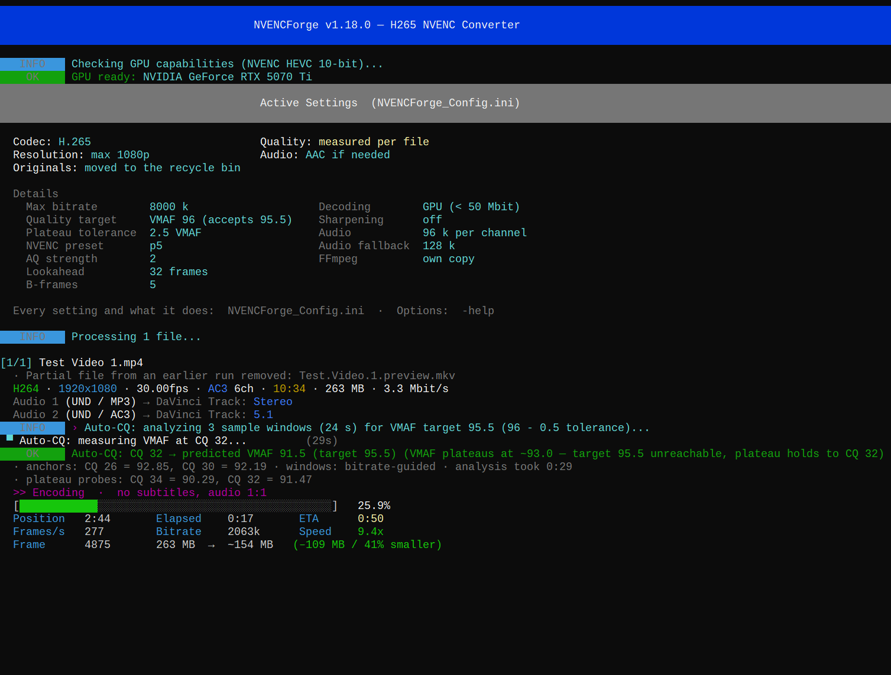

<div align="center">

# 🎬 NVENCForge

### Drop a video, get it back smaller: quality-tuned GPU encoding, drag-and-drop.

**H.265 / AV1 NVENC batch encoder with a DaVinci Resolve workflow and lossless split/join, for Windows.**
HDR-aware. Resilient. DaVinci-Resolve-ready. One EXE.

*⚙️ Encoding uses an NVIDIA GPU with NVENC when you have one — or `-cpu` to encode on the processor instead, which works on **any** PC (as do the DaVinci Resolve, split and join tools).*

*Powered by FFmpeg, which does the actual encoding. NVENCForge is the automation, validation and safety layer around it.*

[](#-requirements)
[](#-requirements)
[](TECHNICAL.md#av1-depth)
[](TECHNICAL.md#building)
[](#-license)
[](https://ko-fi.com/burnersen)

**[⬇️ Download the latest release](https://github.com/burnersen/NVENCForge/releases/latest)** · **[☕ Buy me a coffee](https://ko-fi.com/burnersen)**

*Free for personal & noncommercial use — [source-available](#-license), never for resale.*



</div>

> ### 🖥️ New: there is a window for this now
>
> Rather click than type? **[NVENCForgeGUI](https://github.com/burnersen/NVENCForgeGUI)**
> is a desktop window around this converter: drag your videos in, watch the
> progress bars, convert up to three at a time, or point it at a folder and let
> it convert whatever lands there. Same converter, same results — it starts
> this exact `NVENCForge.exe` and reads its event channel.
>
> <a href="https://github.com/burnersen/NVENCForgeGUI"></a>
>
> [**→ Download the window**](https://github.com/burnersen/NVENCForgeGUI/releases)

---

**📑 Contents**

- [⚡ 30 seconds, no manual](#-30-seconds-no-manual)
- [🤔 Which of these is you?](#which-of-these-is-you)
- [🎯 Will my files actually get smaller?](#-will-my-files-actually-get-smaller)
- [✨ What NVENCForge does](#-what-nvencforge-does)
- [🎚️ Auto-CQ — measured quality, per file](#auto-cq)
- [📊 Measured, not claimed](#-measured-not-claimed)
- [🚀 Usage](#-usage)
- [🧩 The other modes](#-the-other-modes)
- [⚙️ Configuration](#configuration)
- [💻 Requirements](#-requirements)
- [📜 License](#-license) · [💬 Feedback](#-feedback--contributions) · [☕ Support](#-support)

> 🔧 **Looking for the deep detail?** Every mode explained in full, every config key, and the complete list of safety nets lives on the **[technical page →](TECHNICAL.md)**

---

## ⚡ 30 seconds, no manual

1. Download `NVENCForge.exe`, a single file with nothing to install.
2. Drag a video (or a whole folder) onto it.
3. Done. Your video is now H.265, smaller, and the original waits untouched in an `originals` folder next to it.

On first run NVENCForge fetches a tested FFmpeg build automatically: no setup, no dependencies. It deliberately uses its **own** copy rather than whatever happens to be in your `PATH` — every quality value in this tool was measured against a known build. Want your own instead? Put `ffmpeg.exe` and `ffprobe.exe` next to the EXE; a local copy always wins and nothing is downloaded.

**Some real numbers** from 12 mixed 4K HDR test files on an RTX 5070 Ti, run with `-original -copyaudio` (original 4K resolution kept, audio copied 1:1, so every saved megabyte comes from the video encode alone):

| Source | Before | After | Saved |
|---|---|---|---|
| 400 Mbit/s HEVC 4K demo | 1 435 MB | 65 MB | **−96 %** |
| HDR10+ / Dolby Vision sample | 510 MB | 107 MB | **−79 %** |
| DTS:X IMAX 4K clip | 383 MB | 129 MB | **−66 %** |
| **Whole batch (12 files)** | **5.4 GB** | **0.9 GB** | **−4 481 MB in 2:58 min** |

A reality check on these figures: the −96 % case is a best case, a short clip with an absurdly high source bitrate, and most of that saving comes from the source being wildly inefficient, not from magic. Typical, already-compressed material shrinks far less, and some files get skipped or remuxed entirely because re-encoding wouldn't help. That skip logic is a feature, not a shortcoming. The encoder is CQ-based (constant quality) in every mode: the size shrinks to whatever the chosen quality level needs. In the default mode (no flags) material above 1080p is also downscaled to 1080p.

> **A word of honesty:** NVENCForge re-encodes, and re-encoding is lossy. It shines on bulky, already-compressed or inefficient files where the space saving is worth a quality hit you won't notice in normal playback. It is **not** an archival tool: keep untouched masters of anything irreplaceable. Originals are moved aside into an `originals` folder, never deleted — but treat that as a safety net, not a backup.

---

<a id="which-of-these-is-you"></a>

## 🤔 Which of these is you?

| The problem | The answer |
|---|---|
| **My videos are eating the whole disk.** | Drag them onto the EXE. Usually half the size or less, with the quality level **measured per file** instead of guessed. |
| **DaVinci Resolve imports my video with no sound at all** — or the 5.1 track is missing, or it won't take the MKV in the first place. | **[`-davinci`](#davinci).** Resolve doesn't read the audio formats MKV files routinely carry, and MKV isn't a supported container either. This splits your file into a Resolve-friendly silent MP4 plus every audio track in a format Resolve actually accepts — and merges everything back when you're done editing. |
| **I need the streams out and back in, bit for bit.** | **[`-split` / `-join`](TECHNICAL.md#split-depth).** Pure 1:1 copy, no re-encode, no cleaning — a true lossless round-trip. |
| **I don't own an Nvidia card.** | **[`-cpu`](#cpu-mode).** Slower, but it runs on any machine. The DaVinci, split and join tools never needed a GPU anyway. |
| **I want it on my iPhone — or on a TV, a tablet, anywhere.** | **[`-mp4`](#apple).** An MP4 tagged the way players expect, so it actually plays: iOS Photos app, smart TVs, browsers. |
| **My old TV shows a black screen for my files.** | **[`-8bit`](#apple).** Some older devices can't decode 10-bit video. This encodes in 8 bit, which they understand. |

---

## 🎯 Will my files actually get smaller?

Short answer: **yes — and never bigger.** Before touching anything, NVENCForge reads each file and picks one of two paths:

- **Worth re-encoding?** It shrinks the video at a constant quality level, with a safety cap calculated from the source's own bitrate (it aims for clearly below the original). So a real conversion is reliably **smaller than the source** — and if a result ever came out bigger, it's thrown away automatically.
- **Already lean?** Some files are so efficiently compressed that re-encoding would only make them *bigger* (yes, that really happens). NVENCForge spots this up front and simply repackages the file in seconds instead of wasting minutes of GPU time on a pointless encode.

You can tell the two apart at a glance by the filename:

| Output name | What happened |
|---|---|
| `Movie.h265.mkv` | Re-encoded to H.265 (smaller) |
| `Movie.h264.mkv` | Left in its codec, just repackaged (already efficient) |

The finished files land in an `output` subfolder, and each source that was converted successfully moves into an `originals` subfolder — so you can compare the two and delete the originals yourself once you're happy. Both folders are skipped on later runs, and already-processed files are recognized by name *and* content, so running NVENCForge twice on the same folder never converts anything a second time.

---

## ✨ What NVENCForge does

- 🧠 **Smart, not brute-force.** Probes every file first: already-efficient videos are remuxed or skipped instead of re-encoded. Quality is constant (CQ), and a per-file bitrate cap derived from the source keeps every re-encode reliably **smaller than the original** — never bigger, with no fixed-bitrate butchering.
- 🎚️ **Auto-CQ — the right quality level, measured per file.** Instead of one fixed CQ for everything, each file gets a quick VMAF-measured analysis that finds the quality level it actually needs — and it's honest about sources that are already compressed to death. Enabled by default; see [Auto-CQ](#auto-cq).
- ⚡ **The picture stays on the graphics card.** 4K sources are decoded **and** downscaled on the GPU (NVDEC + `scale_cuda`, Lanczos) instead of being shuttled through system memory. Decoding is **bit-identical** — verified by comparing frame hashes, not by eyeballing it. Sources above a configurable bitrate ceiling stay on the CPU on purpose, and any decoder hiccup silently falls back.
- 🌈 **HDR-aware.** HDR10 (PQ) and HLG are detected by their transfer function. Colour tags are copied straight from the source, **never fabricated** — a made-up value is exactly what has broken HDR conversions in the past.
- 🛡️ **Safe with your files.** Originals move into an `originals` folder only *after* the output has been probed and validated — nothing is ever deleted. Existing files are never overwritten. Abort mid-encode? You keep a playable `.preview.mkv`.
- 🚦 **Resilient by design.** Per-file locks, a stall watchdog for frozen encodes, and a multi-stage fallback cascade (subs → no subs → AAC → video-only) so one broken stream doesn't take down a whole batch.
- 👯 **Parallel out of the box.** Start the same command in two terminals; instances lock files individually and split the work automatically.
- 🎛️ **DaVinci-Resolve-safe audio.** DTS, TrueHD, EAC3, FLAC, Opus & >5.1 layouts become AAC that Resolve actually imports — or stay 1:1 with `-copyaudio`.
- 🔁 **Ships with its own source.** The EXE carries the exact source it was built from and extracts it on first run.
- 🌍 **Unicode-safe filename cleanup.** `Movie (2016) [BluRay] x264.mkv` → `Movie.2016.h265.mkv`. Every script in the world survives, release-group noise doesn't.

> The full mechanics behind each of these — all eight categories of safety nets — are on the **[technical page →](TECHNICAL.md#under-the-hood)**

---

<a id="auto-cq"></a>

## 🎚️ Auto-CQ: measured quality, per file

Every video compresses differently: one file looks perfect at CQ 30, another needs CQ 24 for the same visual quality. A single fixed quality level is always a compromise — too generous for easy material (wasted megabytes), too optimistic for hard material. **Auto-CQ replaces that guesswork with an actual measurement**, and it's on by default.

Before each encode, a short per-file analysis runs — typically well under a minute, even for a two-hour movie:

1. **Scan.** The bitrate profile is read *without decoding*, and short sample windows are placed on the demanding scenes. The hardest scene is always included, so easy scenes can't paint a rosy picture.
2. **Probe.** Those windows are test-encoded at two anchor quality levels using *exactly* the settings of the real encode, then scored with **VMAF** (Netflix's perceptual quality metric, 0–100, where ~95+ is visually transparent to most viewers).
3. **Pick & verify.** The CQ that hits the target (default: VMAF 96) is derived from the anchors — and then confirmed with one more real measurement. No blind trust in interpolation.

Auto-CQ is also honest about its limits: on heavily pre-compressed sources the reachable quality **saturates** below the target — no CQ can restore detail that's already gone. Rather than pointlessly escalating to expensive quality levels, it detects the plateau and moves to cheaper ones that provably stay near the reachable maximum. On such files that routinely saves a third of the size at no visible cost.

For a single run: `-noautocq` skips the analysis, `-cq NN` forces a fixed level.

> Every tuning knob, the plateau budget and how the measurement avoids its own pitfalls: **[Auto-CQ in depth →](TECHNICAL.md#auto-cq-depth)**

---

## 📊 Measured, not claimed

This tool's defaults aren't taste — they're what came out of real measurements on real files. Each figure carries the date it was taken, so you can judge its age:

| What | Result | Measured |
|---|---|---|
| **Encoder bit distribution** (`aqStrength` 8 → 2, plus one more B-frame) | **8–28 % smaller files at the same quality and the same encode time**, across four real sources | 15 Aug 2026 |
| **GPU downscaling** replacing the CPU path | 4K→1080p in **29 s instead of 35 s**, and *closer* to the source than before (VMAF 97.62 vs 97.32 for the old CPU bicubic) | 6 Aug 2026 |
| **GPU vs CPU encoding** at equal file size | NVENC `p5` and libx265 `fast` land at the **same quality per byte** — NVENC four times faster | 25 Jul 2026 |

The same principle drives the startup check: instead of a built-in table of GPU models, NVENCForge **asks your card what it can do** and uses the best settings it accepts. A list would be guesswork for every card nobody could test.

---

## 🚀 Usage

```
NVENCForge.exe [flags] [files/folders]
NVENCForge.exe -davinci [files]
NVENCForge.exe -split [files/folders]
NVENCForge.exe -join [video + audio/subtitle files]
```

| Flag | Effect |
|---|---|
| *(none)* | Convert every supported video in the current folder |
| `-help` / `-h` / `-?` | Print the complete option list and exit — no download, no GPU probe |
| `-NNNN` | Max target bitrate in kbps (e.g. `-10000`) |
| `-orig` / `-original` | Keep original resolution (no 1080p downscale), raised bitrate cap |
| `-copyaudio` / `-ca` | Copy all audio 1:1, no AAC re-encode |
| `-av1` | Encode **AV1** instead of H.265 (RTX 40+) → `.av1.mkv` |
| `-mp4` | Write an **MP4 that plays almost everywhere** (H.265/`hvc1` + AAC + faststart). *(`-apple` still works — it's the old name)* |
| `-8bit` | Encode in **8 bit** instead of 10 bit, for older devices that reject "Main 10" |
| `-cpu` | Encode on the **processor** — no NVIDIA card needed (libx265, or SVT-AV1 with `-av1`) |
| `-autocq` | Measure the CQ per file — **on by default**; set `autoCQ=false` in the config to disable |
| `-noautocq` | Disable Auto-CQ for this run |
| `-cq NN` | Force a fixed CQ (H.265 1–51, AV1 1–63) |
| `-keep` | Keep the originals exactly where they are |
| `-shutdown` | Shut the PC down 30 s after the batch finishes |
| `-json` | Report progress as **JSON lines on stdout** — for front-ends and scripts ([details](TECHNICAL.md#json-events)) |
| `-davinci` | DaVinci Resolve workflow (split / extract / merge); must be the first argument |
| `-split` | Lossless split: every stream copied 1:1; must be the first argument |
| `-join` | Lossless join: recombine picture + audio/subtitles into one MKV; must be the first argument |

Flags combine freely: `NVENCForge.exe -av1 -original -copyaudio -shutdown Movie.mkv`

Supported input: `mp4 mkv ts avi mov flv wmv webm m4v mts m2ts`

### 💡 Pro tip: put NVENCForge into your right-click "Send to" menu

Pure drag & drop, no command line — this is my own workflow:

1. Keep `NVENCForge.exe` in a folder where you have **write access** (e.g. `Documents\NVENCForge`, *not* `C:\Program Files`).
2. Press `Win+R`, type `shell:sendto`, press Enter.
3. Create a shortcut to `NVENCForge.exe` in there, one per favourite mode, numbered so they sort nicely. Append the arguments at the end of the *Target* field (shortcut → Properties):

   | Shortcut name | Arguments (after the EXE path) |
   |---|---|
   | `1 NVENCForge Convert 1080` | *(none, default mode)* |
   | `2 NVENCForge Original Copyaudio` | `-original -copyaudio` |
   | `3 NVENCForge AV1 Original` | `-av1 -original` |
   | `4 NVENCForge MP4` | `-mp4` |
   | `5 NVENCForge DaVinci` | `-davinci` |

4. **Important:** clear the **"Start in"** field of every shortcut; it must be **empty**, otherwise "Send to" won't work correctly.

From then on: select any videos → right-click → *Send to* → pick a mode. Done.

---

## 🧩 The other modes

<a id="apple"></a>
<a id="cpu-mode"></a>
<a id="davinci"></a>

| Mode | What it's for |
|---|---|
| 🔮 **AV1** (`-av1`) | Switches to `av1_nvenc` (RTX 40+). Reaches H.265 quality at noticeably smaller sizes; Auto-CQ measures it on its own calibrated scale. 10-bit and HDR pass-through included. H.265 stays the default. **[Details →](TECHNICAL.md#av1-depth)** |
| 📱 **MP4** (`-mp4`) and **8-bit** (`-8bit`) | An `.mp4` tagged `hvc1` with AAC and faststart — what the iOS Photos app, smart TVs and browsers actually accept. An already-converted file is repackaged losslessly, not encoded twice. `-8bit` is the rescue for older devices that reject 10-bit. **[Details →](TECHNICAL.md#mp4-depth)** |
| 💻 **CPU mode** (`-cpu`) | Encodes on the processor (libx265, or SVT-AV1 with `-av1`) so the tool works without an NVIDIA card. Everything else stays identical. It's not a quality upgrade — at the default preset it lands where your GPU already is. **[Details and the honest numbers →](TECHNICAL.md#cpu-depth)** |
| 🧰 **DaVinci Resolve** (`-davinci`) | Resolve can't read the audio formats MKV files routinely carry. This leaves the **picture untouched** (stream copy) and only converts the audio Resolve refuses, plus cleaned subtitles — then merges everything back after editing. **[Details and the workflow →](TECHNICAL.md#davinci-depth)** |
| 🪓 **Split / Join** (`-split` / `-join`) | Every stream copied 1:1 into its native container and back. No re-encode, no cleaning — a true lossless round-trip. **[Details →](TECHNICAL.md#split-depth)** |

---

<a id="configuration"></a>

## ⚙️ Configuration

Everything lives in `NVENCForge_Config.ini` next to the EXE — auto-created, and **you don't have to touch it at all.** The defaults are the measured ones. An invalid value is reset individually in the file with a warning, leaving your comments and everything else untouched.

The file is split in two: **PART 1** holds the handful of settings people actually change — `maxResolution`, `autoCQTargetVMAF`, `audioKbpsPerChannel`, `retireMode`, `encoder` — and **PART 2** the expert settings. Every entry explains what it does and which values are allowed.

The three worth knowing about:

| Key | Default | In one line |
|---|---|---|
| `autoCQTargetVMAF` | `96` | The quality target Auto-CQ aims for |
| `retireMode` | `folder` | Where originals go: an `originals` folder next to the source (instant, nothing deleted), or `recyclebin` |
| `gpuDecode` | `true` | Decode on the GPU; bit-identical, just faster. Sources above `gpuDecodeMaxMbit` (50) use the CPU on purpose |

> Every key with its measured reasoning: **[Configuration in full →](TECHNICAL.md#config-depth)**

---

## 💻 Requirements

- Windows 10/11 x64
- For GPU encoding: an NVIDIA GPU whose NVENC can encode **10-bit HEVC** (Pascal / GTX 10 series and newer certainly can); **RTX 40+ for AV1**. Older cards aren't turned away — the startup check measures what yours actually supports and quietly runs with the best settings it accepts
- **No NVIDIA card? [`-cpu`](TECHNICAL.md#cpu-depth) encodes on the processor instead** — slower, but it runs anywhere
- The `-davinci`, `-split` and `-join` modes run on **any** hardware (no GPU needed)
- FFmpeg: downloaded automatically on first run (or drop your own `ffmpeg.exe`/`ffprobe.exe` next to the EXE)

> **Why NVENC by default?** Hardware encoding trades a little compression efficiency for a huge speed gain and leaves your CPU free — for batch-crushing a large library that tradeoff is the whole point. Measured 25 Jul 2026 on real footage, NVENC `p5` and libx265 `fast` land at the *same* quality per byte, and NVENC does it four times faster; only a slow x265 encode pulls meaningfully ahead (+1 VMAF for triple the time). If you want that, `-cpu` with `cpuPreset=slow` gives it to you.

---

## 🛡️ Windows SmartScreen / antivirus warnings

Windows or your antivirus may warn you the first time you run `NVENCForge.exe`. The honest reason: **the EXE is not code-signed.** Signing certificates cost several hundred euros *per year*, and this is a free hobby project with zero income. Unsigned Go binaries are frequent false-positive targets; there is nothing I can do about it except be transparent.

You don't have to trust me blindly: **scan it** on [VirusTotal](https://www.virustotal.com), **read it** — the complete source is in this repository — or **[build it yourself](TECHNICAL.md#building)**. The downloaded EXE even carries its own source inside and extracts it on first run.

If SmartScreen blocks the start: click **"More info" → "Run anyway"**.

---

## 🧑‍🎨 The story

NVENCForge is a personal hobby project, built over two months of evenings to fit my own media workflow. Every feature, every workflow rule and all the real-world testing on 4K HDR files came from me. It started as a tool just for myself, but if it fits your workflow too, all the better.

---

## 📜 License

NVENCForge is source-available under the [PolyForm Noncommercial License 1.0.0](LICENSE.md).
Free to use, study, modify and share for any **noncommercial** purpose: personal use, hobby, education, research. **Commercial use, resale or bundling into paid products is not permitted** without a separate license from the author. Want a commercial license? Open an issue or reach out.

### FFmpeg

NVENCForge does **not** bundle FFmpeg. On first run it downloads an official static build from the [BtbN FFmpeg-Builds](https://github.com/BtbN/FFmpeg-Builds) project (GPL-licensed) onto your machine, or you provide your own copy. FFmpeg is a separate work by the [FFmpeg project](https://ffmpeg.org) under its own license; NVENCForge invokes it as an external program. This software uses libraries from the FFmpeg project under the GPL.

---

## 💬 Feedback & contributions

**This is where you come in.** So far it's mostly been just me and my own test files — I'd genuinely love to hear from you. Does it work on your videos? Did something break, feel clunky, or surprise you? Is there a feature you're missing?

**Please don't be shy** — [open an issue](../../issues), even a one-liner. A quick "it just worked, thanks", a "this part confused me", a bug report, a wish for the next version: it's all welcome, and no question is too small. Honestly, even knowing the tool is being used out there is motivating. If you're not sure how to start, just say hi.

Forks and pull requests for noncommercial improvements are very welcome too. When reporting a bug, the console output helps a lot — run with `-debug` for the full detail.

---

## ☕ Support

NVENCForge is free and made in my spare time, on my own hardware and electricity bill. If it saved you time or a pile of disk space and you'd like to say thanks, you can [drop a little something in the tip jar on Ko-fi](https://ko-fi.com/burnersen) — it keeps the forge hot. 🔥 Completely optional, and either way: thank you for using it!

---

## ⚠️ Disclaimer

NVENCForge is free hobby software, provided **"as is", without any warranty or condition of any kind**. It was built and tested with care (your originals are never deleted, only moved into an `originals` folder after the output has been validated), but you use it **at your own risk**. As far as the applicable law allows, the author is not liable for any damages or data loss arising from the use of this software. See the *No Liability* clause of the [license](LICENSE.md).

---

<sub>NVIDIA, NVENC, DaVinci Resolve, FFmpeg and VMAF are trademarks of their respective owners. NVENCForge is an independent hobby project and is not affiliated with, endorsed by, or sponsored by any of them.</sub>
