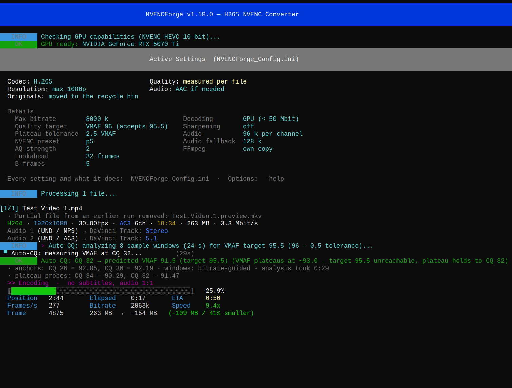
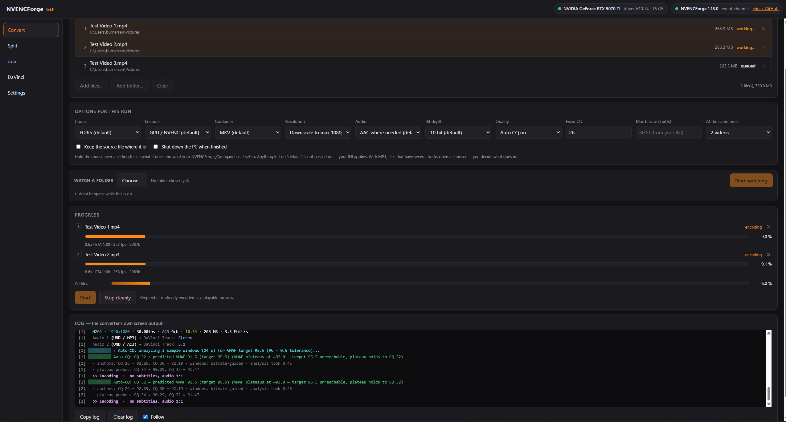

<div align="center">

# 🎬 NVENCForge

### Drop a video, get it back smaller: quality-tuned GPU encoding, drag-and-drop.

**H.265 / AV1 NVENC batch encoder with a DaVinci Resolve workflow and lossless split/join, for Windows.**
HDR-aware. Resilient. DaVinci-Resolve-ready. One EXE.

*⚙️ Encoding uses an NVIDIA GPU with NVENC when you have one — or `-cpu` to encode on the processor instead, which works on **any** PC (as do the DaVinci Resolve, split and join tools).*

*Powered by FFmpeg, which does the actual encoding. NVENCForge is the automation, validation and safety layer around it.*

[](#-requirements)
[](#-requirements)
[](TECHNICAL.md#av1-depth)
[](TECHNICAL.md#building)
[](#-license)
[](https://ko-fi.com/burnersen)

**[⬇️ Download the latest release](https://github.com/burnersen/NVENCForge/releases/latest)** · **[☕ Buy me a coffee](https://ko-fi.com/burnersen)**

*Free for everyone, at home or at work — open source under the [GPLv3](#-license).*



</div>

> ### 🖥️ New: there is a window for this now
>
> Rather click than type? **[NVENCForgeGUI](https://github.com/burnersen/NVENCForgeGUI)**
> is a desktop window around this converter: drag your videos in, watch the
> progress bars, convert up to three at a time, or point it at a folder and let
> it convert whatever lands there. Same converter, same results — it starts
> this exact `NVENCForge.exe` and reads its event channel.
>
> <a href="https://github.com/burnersen/NVENCForgeGUI"></a>
>
> [**→ Download the window**](https://github.com/burnersen/NVENCForgeGUI/releases)

---

**📑 Contents**

- [⚡ 30 seconds, no manual](#-30-seconds-no-manual)
- [🤔 Which of these is you?](#which-of-these-is-you)
- [🎯 Will my files actually get smaller?](#-will-my-files-actually-get-smaller)
- [✨ What NVENCForge does](#-what-nvencforge-does)
- [🎚️ Auto-CQ — measured quality, per file](#auto-cq)
- [📊 Measured, not claimed](#-measured-not-claimed)
- [🚀 Usage](#-usage)
- [🧩 The other modes](#-the-other-modes)
- [⚙️ Configuration](#configuration)
- [💻 Requirements](#-requirements)
- [📜 License](#-license) · [💬 Feedback](#-feedback--contributions) · [☕ Support](#-support)

> 🔧 **Looking for the deep detail?** Every mode explained in full, every config key, and the complete list of safety nets lives on the **[technical page →](TECHNICAL.md)**

---

## ⚡ 30 seconds, no manual

1. Download `NVENCForge.exe`, a single file with nothing to install.
2. Drag a video (or a whole folder) onto it.
3. Done. Your video is now H.265, smaller, and the original waits untouched in an `originals` folder next to it.

On first run NVENCForge fetches a tested FFmpeg build automatically: no setup, no dependencies. It deliberately uses its **own** copy rather than whatever happens to be in your `PATH` — every quality value in this tool was measured against a known build. Want your own instead? Put `ffmpeg.exe` and `ffprobe.exe` next to the EXE; a local copy always wins and nothing is downloaded.

**Some real numbers** — five 1080p films straight out of everyday use plus a 720p and a 480p clip, encoded to AV1 on an RTX 5070 Ti and measured on 27 Sep 2026: the previous version 1.34.0 (still with its bitrate caps) against 2.0.0 at the default target VMAF 96 and at 97.

| Source material | 1.34.0 (bitrate caps) | 2.0.0 · target 96 (default) | 2.0.0 · target 97 |
|---|---|---|---|
| 1080p · 30 fps · 11.7 Mbit/s · 48 min | CQ 37 · VMAF 97.1 | CQ 38 · VMAF 96.3 · re-encoded, ~79 % smaller | CQ 36 · VMAF 97.3 · re-encoded, **−81 %** (4 154 → 776 MB) |
| 1080p · 60 fps · 10.7 Mbit/s · 19 min | CQ 32 · VMAF 96.0 | CQ 33 · VMAF 96.4 · re-encoded, ~35 % smaller | CQ 31 · VMAF 97.2 · re-encoded, **−23 %** (1 507 → 1 165 MB) |
| 1080p · 30 fps · 3.1 Mbit/s · 53 min | CQ 32 · VMAF 92.0 | CQ 35 · VMAF 96.2 · re-encoded, ~28 % smaller | CQ 33 · VMAF 97.2 · repackaged: only ~16 % smaller |
| 1080p · 60 fps · 12.2 Mbit/s · 40 min | CQ 32 · VMAF 91.7 | CQ 30 · VMAF 96.1 · repackaged: only ~2 % smaller | CQ 27 · VMAF 97.3 · repackaged: would grow ~9 % |
| 1080p · 60 fps · 12.2 Mbit/s · 32 min | CQ 32 · VMAF 91.5 | CQ 29 · VMAF 96.5 · repackaged: would grow ~2 % | CQ 27 · VMAF 97.4 · repackaged: would grow ~21 % |
| 720p · 30 fps · 2.7 Mbit/s · 5 min clip | CQ 28 · VMAF 96.7 (measured at 720p) | CQ 29 · VMAF 96.4 · repackaged: only ~16 % smaller | CQ 27 · VMAF 97.2 · repackaged: only ~5 % smaller |
| 480p · 30 fps · 1.5 Mbit/s · 5 min clip | CQ 36 · VMAF 96.7 (measured at 480p) | repackaged: below 720p | repackaged: below 720p |

**Reading the table.** *CQ* is the quality dial: the lower the number, the more bits the encoder spends. NVENCForge measures the right one for each file, scored with *VMAF* (a 0–100 picture-quality score, where 100 means identical to the source).

The 1.34.0 column is the uncomfortable part: on four of the five films the bitrate caps, not the quality search, decided the picture — its two test settings (CQ 24 and CQ 32) scored *exactly* the same, because the cap cut both down to the same size. Three of those films came out at VMAF 91–92 without anyone having asked for it.

2.0.0 has no caps. Every re-encode holds the target, and a file that would not get at least 20 % smaller (`minSavePercent`) is repackaged losslessly instead — the picture stays exactly as it is. Values marked **~** are the saving the analysis predicted before encoding (from a size probe across the whole film wherever it was close to the limit); the two bold results were encoded in full and landed at 23 % (predicted 23 %) and 81 % (predicted 76 %).

Grainy 60 fps films are the telling case: to really look like their source they need about as many bits as the source already spends, so re-encoding them would only cost picture. That is also why the default target is 96 — at 97 only two of the five films were worth re-encoding, at 96 three.

A reality check on these figures: the encoder is CQ-based (constant quality) in every mode, so a file shrinks to whatever the measured quality level needs. Bulky or inefficiently encoded sources give up a lot, already-lean ones give up little, and many get repackaged instead because re-encoding wouldn't help them. That is a feature, not a shortcoming. In the default mode (no flags) material above 1080p is also downscaled to 1080p.

> **A word of honesty:** NVENCForge re-encodes, and re-encoding is lossy. It shines on bulky, already-compressed or inefficient files where the space saving is worth a quality hit you won't notice in normal playback. It is **not** an archival tool: keep untouched masters of anything irreplaceable. Originals are moved aside into an `originals` folder, never deleted — but treat that as a safety net, not a backup.

---

<a id="which-of-these-is-you"></a>

## 🤔 Which of these is you?

| The problem | The answer |
|---|---|
| **My videos are eating the whole disk.** | Drag them onto the EXE. Usually half the size or less, with the quality level **measured per file** instead of guessed. |
| **DaVinci Resolve imports my video with no sound at all** — or the 5.1 track is missing, or it won't take the MKV in the first place. | **[`-davinci`](#davinci).** Resolve doesn't read the audio formats MKV files routinely carry, and MKV isn't a supported container either. This splits your file into a Resolve-friendly silent MP4 plus every audio track in a format Resolve actually accepts — and merges everything back when you're done editing. |
| **I need the streams out and back in, bit for bit.** | **[`-split` / `-join`](TECHNICAL.md#split-depth).** Pure 1:1 copy, no re-encode, no cleaning — a true lossless round-trip. |
| **I don't own an Nvidia card.** | **[`-cpu`](#cpu-mode).** Slower, but it runs on any machine. The DaVinci, split and join tools never needed a GPU anyway. |
| **I want it on my iPhone — or on a TV, a tablet, anywhere.** | **[`-mp4`](#apple).** An MP4 tagged the way players expect, so it actually plays: iOS Photos app, smart TVs, browsers. |
| **My old TV shows a black screen for my files.** | **[`-8bit`](#apple).** Some older devices can't decode 10-bit video. This encodes in 8 bit, which they understand. |

---

## 🎯 Will my files actually get smaller?

Short answer: **yes — and never bigger.** Before touching anything, NVENCForge reads each file and picks one of two paths:

- **Worth re-encoding?** The quality analysis also predicts how much smaller the whole file gets. Only when that is at least **20 %** (`minSavePercent`) is the video re-encoded, at a constant quality level. Close to that limit, ten more spots across the film are encoded to be sure, and the finished file is checked once more — a result that misses the minimum is thrown away automatically. (A 4K file that is scaled down to 1080p only has to come out smaller at all: the smaller picture is what you asked for.)
- **Not worth it?** Some files are so efficiently compressed that re-encoding would barely help or even make them *bigger* (yes, that really happens). NVENCForge then simply repackages the file losslessly in seconds — the picture stays exactly as it is. Videos below 720p and sources that are already at the bitrate floor of their resolution take this path without any measuring.

You can tell the two apart at a glance by the filename:

| Output name | What happened |
|---|---|
| `Movie.h265.mkv` | Re-encoded to H.265 (smaller) |
| `Movie.h264.mkv` | Left in its codec, just repackaged (already efficient) |

The finished files land in an `output` subfolder, and each source that was converted successfully moves into an `originals` subfolder — so you can compare the two and delete the originals yourself once you're happy. Both folders are skipped on later runs, and already-processed files are recognized by name *and* content, so running NVENCForge twice on the same folder never converts anything a second time.

---

## ✨ What NVENCForge does

- 🧠 **Smart, not brute-force.** Probes every file first: videos that would not get at least 20 % smaller are repackaged losslessly instead of re-encoded. Quality is constant (CQ) with **no bitrate cap** — the measured quality target alone decides the picture, so every re-encode is both **smaller than the original** and as good as you asked for.
- 🎚️ **Auto-CQ — the right quality level, measured per file.** Instead of one fixed CQ for everything, each file gets a quick VMAF-measured analysis that finds the quality level it actually needs — and it's honest about sources that are already compressed to death. Enabled by default; see [Auto-CQ](#auto-cq).
- ⚡ **The picture stays on the graphics card.** 4K sources are decoded **and** downscaled on the GPU (NVDEC + `scale_cuda`, Lanczos) instead of being shuttled through system memory. Decoding is **bit-identical** — verified by comparing frame hashes, not by eyeballing it. Sources above a configurable bitrate ceiling stay on the CPU on purpose, and any decoder hiccup silently falls back.
- 🌈 **HDR-aware.** HDR10 (PQ) and HLG are detected by their transfer function. Colour tags are copied straight from the source, **never fabricated** — a made-up value is exactly what has broken HDR conversions in the past.
- 🛡️ **Safe with your files.** Originals move into an `originals` folder only *after* the output has been probed and validated — nothing is ever deleted. Existing files are never overwritten. Abort mid-encode? You keep a playable `.preview.mkv`.
- 🚦 **Resilient by design.** Per-file locks, a stall watchdog for frozen encodes, and a multi-stage fallback cascade (subs → no subs → AAC → video-only) so one broken stream doesn't take down a whole batch.
- 👯 **Parallel out of the box.** Start the same command in two terminals; instances lock files individually and split the work automatically.
- 🎛️ **DaVinci-Resolve-safe audio.** DTS, TrueHD, EAC3, FLAC, Opus & >5.1 layouts become AAC that Resolve actually imports — or stay 1:1 with `-copyaudio`.
- 🔓 **Open source.** The complete source of every release lives [right here on GitHub](https://github.com/burnersen/NVENCForge) under the GPLv3 — read it, audit it, change it, or build it yourself.
- 🌍 **Unicode-safe filename cleanup.** `Movie (2016) [BluRay] x264.mkv` → `Movie.2016.h265.mkv`. Every script in the world survives, release-group noise doesn't.

> The full mechanics behind each of these — all eight categories of safety nets — are on the **[technical page →](TECHNICAL.md#under-the-hood)**

---

<a id="auto-cq"></a>

## 🎚️ Auto-CQ: measured quality, per file

Every video compresses differently: one file looks perfect at CQ 30, another needs CQ 24 for the same visual quality. A single fixed quality level is always a compromise — too generous for easy material (wasted megabytes), too optimistic for hard material. **Auto-CQ replaces that guesswork with an actual measurement**, and it's on by default.

Before each encode, a short per-file analysis runs — typically well under a minute, even for a two-hour movie:

1. **Scan.** The bitrate profile is read *without decoding*, and short sample windows are placed on the demanding scenes. The hardest scene is always included, so easy scenes can't paint a rosy picture.
2. **Probe.** Those windows are test-encoded at two anchor quality levels using *exactly* the settings of the real encode, then scored with **VMAF** (Netflix's perceptual quality metric, 0–100, where ~95+ is visually transparent to most viewers).
3. **Pick & verify.** The CQ that hits the target (default: VMAF 96) is derived from the anchors — and then measured itself. The target is a **floor**: if the pick misses it, the next steps are measured until one holds it; if it clears it by a wide margin, one step thriftier is tried. No blind trust in interpolation.
4. **Worth it?** The same samples predict how much smaller the whole file gets. Below `minSavePercent` (20 % by default) the file is repackaged losslessly instead — see [Will my files actually get smaller?](#-will-my-files-actually-get-smaller)

Pictures smaller than 1080p are measured the way they look on a Full HD screen: both sides are enlarged to 1080p before the comparison. Measured in their own small size, they score far better than they look full-screen (720p: 96.2 in its own size against 92.9 enlarged).

Auto-CQ is also honest about its limits: on heavily pre-compressed sources the reachable quality **saturates** below the target — no CQ can restore detail that's already gone. Rather than pointlessly escalating to expensive quality levels, it detects the plateau and moves to cheaper ones that provably stay near the reachable maximum — every step confirmed by a real measurement. And it never buys quality nobody can see: once one more CQ step gains too little VMAF to justify the space it costs, the search stops there. That test runs both ways: quality is only given up when the file really gets smaller. On a source that is already squeezed dry, four CQ steps were measured to buy 1 % of file size for 0.7 VMAF — there it keeps the picture instead.

Grainy or very busy films are the opposite case — the target *is* reachable there, just expensive: film grain is random detail, so the encoder has to pay for it frame after frame. Since 2.0.0 there is deliberately **no bitrate cap** for that: a cap can only push the picture below the target you asked for. Such a file is re-encoded at the target when that still saves the minimum — and repackaged untouched when it does not.

For a single run: `-noautocq` skips the analysis, `-cq NN` forces a fixed level.

> Every tuning knob, the plateau budget and how the measurement avoids its own pitfalls: **[Auto-CQ in depth →](TECHNICAL.md#auto-cq-depth)**

---

## 📊 Measured, not claimed

This tool's defaults aren't taste — they're what came out of real measurements on real files. Each figure carries the date it was taken, so you can judge its age:

| What | Result | Measured |
|---|---|---|
| **Encoder bit distribution** (`aqStrength` 8 → 2, plus one more B-frame) | **8–28 % smaller files at the same quality and the same encode time**, across four real sources | 15 Aug 2026 |
| **GPU downscaling** replacing the CPU path | 4K→1080p in **29 s instead of 35 s**, and *closer* to the source than before (VMAF 97.62 vs 97.32 for the old CPU bicubic) | 6 Aug 2026 |
| **GPU vs CPU encoding** at equal file size | NVENC `p5` and libx265 `fast` land at the **same quality per byte** — NVENC four times faster | 25 Jul 2026 |

The same principle drives the startup check: instead of a built-in table of GPU models, NVENCForge **asks your card what it can do** and uses the best settings it accepts. A list would be guesswork for every card nobody could test.

---

## 🚀 Usage

```
NVENCForge.exe [flags] [files/folders]
NVENCForge.exe -davinci [files]
NVENCForge.exe -split [files/folders]
NVENCForge.exe -join [video + audio/subtitle files]
```

| Flag | Effect |
|---|---|
| *(none)* | Convert every supported video in the current folder |
| `-help` / `-h` / `-?` | Print the complete option list and exit — no download, no GPU probe |
| `-orig` / `-original` | Keep original resolution (no 1080p downscale) |
| `-downscale` | Scale down as configured after all, even if `keepResolution=true` |
| `-copyaudio` / `-ca` | Copy all audio 1:1, no AAC re-encode |
| `-aac` | Re-encode the audio DaVinci Resolve cannot read (AC3, DTS, TrueHD, FLAC …) to AAC, even if `audioMode=copy` — in an MKV too |
| `-av1` | Encode **AV1** instead of H.265 (RTX 40+) → `.av1.mkv` |
| `-h265` | Force **H.265** for this run — beats an earlier `-av1` on the command line *and* `codec=av1` in the config (the later switch wins) |
| `-mp4` | Write an **MP4 that plays almost everywhere** (H.265 tagged `hvc1` + AAC + faststart). Works with `-av1` too, tagged `av01` — fewer devices play that. *(`-apple` still works — it's the old name)* |
| `-mkv` | Write an **MKV** after all, even if the config says `container=mp4` |
| `-8bit` | Encode in **8 bit** instead of 10 bit, for older devices that reject "Main 10" |
| `-10bit` | Encode in **10 bit** after all, even if the config says `bitDepth=8` |
| `-cpu` | Encode on the **processor** — no NVIDIA card needed (libx265, or SVT-AV1 with `-av1`) |
| `-gpu` | Encode on the **graphics card** after all, even if the config says `encoder=cpu` *(alias: `-nvidia`)* |
| `-autocq` | Measure the CQ per file — **on by default**; set `autoCQ=false` in the config to disable |
| `-noautocq` | Disable Auto-CQ for this run |
| `-cq NN` | Force a fixed CQ (H.265 1–51, AV1 1–63) |
| `-cropcheck` | Show where black bars **would** be cut — writes a picture, converts nothing |
| `-crop` | Cut the black bars off letterboxed video — **off by default**, see [what it changes](#crop) |
| `-nocrop` | Keep the black bars for this run |
| `-keep` | Keep the originals exactly where they are |
| `-nokeep` | Move the originals away as configured, even if the config says `keepSource=true` |
| `-shutdown` | Shut the PC down 30 s after the batch finishes |
| `-noshutdown` | Do **not** shut down, even if the config says `autoShutdown=true` |
| `-json` | Report progress as **JSON lines on stdout** — for front-ends and scripts ([details](TECHNICAL.md#json-events)) |
| `-davinci` | DaVinci Resolve workflow (split / extract / merge); must be the first argument |
| `-split` | Lossless split: every stream copied 1:1; must be the first argument |
| `-join` | Lossless join: recombine picture + audio/subtitles into one MKV; must be the first argument |

Flags combine freely: `NVENCForge.exe -av1 -original -copyaudio -shutdown Movie.mkv`

Supported input: `mp4 mkv ts avi mov flv wmv webm m4v mts m2ts`

### 💡 Pro tip: put NVENCForge into your right-click "Send to" menu

Pure drag & drop, no command line — this is my own workflow:

1. Keep `NVENCForge.exe` in a folder where you have **write access** (e.g. `Documents\NVENCForge`, *not* `C:\Program Files`).
2. Press `Win+R`, type `shell:sendto`, press Enter.
3. Create a shortcut to `NVENCForge.exe` in there, one per favourite mode, numbered so they sort nicely. Append the arguments at the end of the *Target* field (shortcut → Properties):

   | Shortcut name | Arguments (after the EXE path) |
   |---|---|
   | `1 NVENCForge Convert 1080` | *(none, default mode)* |
   | `2 NVENCForge Original Copyaudio` | `-original -copyaudio` |
   | `3 NVENCForge AV1 Original` | `-av1 -original` |
   | `4 NVENCForge MP4` | `-mp4` |
   | `5 NVENCForge DaVinci` | `-davinci` |

4. **Important:** clear the **"Start in"** field of every shortcut; it must be **empty**, otherwise "Send to" won't work correctly.

From then on: select any videos → right-click → *Send to* → pick a mode. Done.

---

## 🧩 The other modes

<a id="apple"></a>
<a id="cpu-mode"></a>
<a id="davinci"></a>
<a id="crop"></a>

| Mode | What it's for |
|---|---|
| ✂️ **Auto-crop** (`-crop`, `-cropcheck`) | Cuts the black bars off letterboxed video. **Off by default, and what it does for you flips with Auto-CQ:** at a fixed CQ a quarter of the frame in bars makes the file ~6 % smaller and the encode 19 % faster; with Auto-CQ on, files come out *larger* — because the bars had been flattering the quality measurement, so letterboxed sources were quietly landing below the target you set. Bars are found from nine samples across the film and the **majority decides**, so a logo flashing up inside a bar no longer holds the cut back. The cut is always **symmetric** — letterbox sits centred, so taking more off the top than the bottom is always wrong. If the samples genuinely disagree (a film that changes aspect ratio part-way, like IMAX scenes), nothing is cut at all. Bars on the sides or on all four edges work the same way. **Subtitles are the exception:** a file carrying picture subtitles (Blu-ray PGS, DVD VobSub) is never cut — those have a fixed position and are usually drawn into the lower bar — and burned-in subtitles are looked for inside the bars themselves: a wide, centred line that returns at a second point in the film calls the cut off, while a one-off copyright notice does not. Text subtitle tracks (SRT, ASS, mov_text) are unaffected, the player places those itself. Run `-cropcheck` first: it draws the proposed cut on the full frame and converts nothing. |
| 🔮 **AV1** (`-av1`) | Switches to `av1_nvenc` (RTX 40+). Reaches H.265 quality at noticeably smaller sizes; Auto-CQ measures it on its own calibrated scale. 10-bit and HDR pass-through included. H.265 stays the default. **[Details →](TECHNICAL.md#av1-depth)** |
| 📱 **MP4** (`-mp4`) and **8-bit** (`-8bit`) | An `.mp4` tagged `hvc1` with AAC and faststart — what the iOS Photos app, smart TVs and browsers actually accept. An already-converted file is repackaged losslessly, not encoded twice. `-8bit` is the rescue for older devices that reject 10-bit. **[Details →](TECHNICAL.md#mp4-depth)** |
| 💻 **CPU mode** (`-cpu`) | Encodes on the processor (libx265, or SVT-AV1 with `-av1`) so the tool works without an NVIDIA card. Everything else stays identical. It's not a quality upgrade — at the default preset it lands where your GPU already is. **[Details and the honest numbers →](TECHNICAL.md#cpu-depth)** |
| 🧰 **DaVinci Resolve** (`-davinci`) | Resolve can't read the audio formats MKV files routinely carry. This leaves the **picture untouched** (stream copy) and only converts the audio Resolve refuses, plus cleaned subtitles — then merges everything back after editing. **[Details and the workflow →](TECHNICAL.md#davinci-depth)** |
| 🪓 **Split / Join** (`-split` / `-join`) | Every stream copied 1:1 into its native container and back. No re-encode, no cleaning — a true lossless round-trip. **[Details →](TECHNICAL.md#split-depth)** |

---

<a id="configuration"></a>

## ⚙️ Configuration

Everything lives in `NVENCForge_Config.ini` next to the EXE — auto-created, and **you don't have to touch it at all.** The defaults are the measured ones. An invalid value is reset individually in the file with a warning, leaving your comments and everything else untouched. Settings added by a newer version are filled in automatically at their proper place, and explanations that changed are brought up to date (your values stay as they are), so an old config file never quietly misses a feature or shows outdated help — your previous file is kept as `.bak`.

The file is split in two: **PART 1** holds the handful of settings people actually change — `maxResolution`, `autoCQTargetVMAF`, `minSavePercent`, `audioKbpsPerChannel`, `retireMode`, `encoder` — and **PART 2** the expert settings. Every entry explains what it does and which values are allowed.

**Since 1.23.0 the basic decisions live there too** — `codec`, `container`, `bitDepth`, `audioMode`, `keepResolution` and `keepSource`. Those used to exist only as a command-line switch, so "always AV1" or "always MP4" had to be repeated on every run. Each of them has a switch *and* a counter-switch (`-av1`/`-h265`, `-mp4`/`-mkv`, `-8bit`/`-10bit`, `-copyaudio`/`-aac`, `-original`/`-downscale`, `-keep`/`-nokeep`), so a single run can go either way.

The four worth knowing about:

| Key | Default | In one line |
|---|---|---|
| `autoCQTargetVMAF` | `96` | The quality target Auto-CQ aims for — a floor, not an average |
| `minSavePercent` | `20` | How much smaller a file must get to be re-encoded; anything less is repackaged losslessly. `0` only rejects results that come out larger |
| `retireMode` | `folder` | Where originals go: an `originals` folder next to the source (instant, nothing deleted), or `recyclebin` |
| `gpuDecode` | `true` | Decode on the GPU; bit-identical, just faster. Sources above `gpuDecodeMaxMbit` (50) use the CPU on purpose |

> Every key with its measured reasoning: **[Configuration in full →](TECHNICAL.md#config-depth)**

---

## 💻 Requirements

- Windows 10/11 x64
- For GPU encoding: an NVIDIA GPU whose NVENC can encode **10-bit HEVC** (Pascal / GTX 10 series and newer certainly can); **RTX 40+ for AV1**. Older cards aren't turned away — the startup check measures what yours actually supports and quietly runs with the best settings it accepts
- **No NVIDIA card? [`-cpu`](TECHNICAL.md#cpu-depth) encodes on the processor instead** — slower, but it runs anywhere
- The `-davinci`, `-split` and `-join` modes run on **any** hardware (no GPU needed)
- FFmpeg: downloaded automatically on first run (or drop your own `ffmpeg.exe`/`ffprobe.exe` next to the EXE)

> **Why NVENC by default?** Hardware encoding trades a little compression efficiency for a huge speed gain and leaves your CPU free — for batch-crushing a large library that tradeoff is the whole point. Measured 25 Jul 2026 on real footage, NVENC `p5` and libx265 `fast` land at the *same* quality per byte, and NVENC does it four times faster; only a slow x265 encode pulls meaningfully ahead (+1 VMAF for triple the time). If you want that, `-cpu` with `cpuPreset=slow` gives it to you.

---

## 🛡️ Windows SmartScreen / antivirus warnings

Windows or your antivirus may warn you the first time you run `NVENCForge.exe`. The honest reason: **the EXE is not code-signed.** Signing certificates cost several hundred euros *per year*, and this is a free hobby project with zero income. Unsigned Go binaries are frequent false-positive targets; there is nothing I can do about it except be transparent.

You don't have to trust me blindly: **scan it** on [VirusTotal](https://www.virustotal.com), **read it** — the complete source is in this repository — or **[build it yourself](TECHNICAL.md#building)**.

If SmartScreen blocks the start: click **"More info" → "Run anyway"**.

---

## 🧑‍🎨 The story

NVENCForge is a personal hobby project, built over two months of evenings to fit my own media workflow. Every feature, every workflow rule and all the real-world testing on 4K HDR files came from me. It started as a tool just for myself, but if it fits your workflow too, all the better.

---

## 📜 License

NVENCForge is free software under the [GNU General Public License, version 3](LICENSE) — that version only (`GPL-3.0-only`).

- **Use it:** Anyone may use NVENCForge free of charge, at home or at work, and read, change and share its source code.
- **The one condition:** Whoever passes on NVENCForge or parts of it — unchanged, changed or built into a program of their own — must include the complete source code and pass everything on under the same license. A closed, paid product with NVENCForge inside is therefore not possible.
- **Free of charge:** NVENCForge is and stays free. The official source is [github.com/burnersen/NVENCForge](https://github.com/burnersen/NVENCForge) — anyone asking money for NVENCForge is selling you what you can get here for free.
- **A separate license for companies:** Want to build NVENCForge into a product that is not meant to be under the GPLv3? You can ask the author for a separate license — just [open an issue](https://github.com/burnersen/NVENCForge/issues).

### FFmpeg

NVENCForge does **not** bundle FFmpeg. On first run it downloads an official static build from the [BtbN FFmpeg-Builds](https://github.com/BtbN/FFmpeg-Builds) project (GPL-licensed) onto your machine, or you provide your own copy. FFmpeg is a separate work by the [FFmpeg project](https://ffmpeg.org) under its own license; NVENCForge invokes it as an external program. This software uses libraries from the FFmpeg project under the GPL.

### Third-party components

The exe is built with these Go libraries. Each keeps its own license, and all of them are compatible with the GPLv3:

- **MIT License:** [pterm](https://github.com/pterm/pterm) with [atomicgo/cursor](https://github.com/atomicgo/cursor), [atomicgo/keyboard](https://github.com/atomicgo/keyboard) and [atomicgo/schedule](https://github.com/atomicgo/schedule), [gookit/color](https://github.com/gookit/color), [lithammer/fuzzysearch](https://github.com/lithammer/fuzzysearch), [mattn/go-runewidth](https://github.com/mattn/go-runewidth), [rivo/uniseg](https://github.com/rivo/uniseg), [xo/terminfo](https://github.com/xo/terminfo)
- **Apache License 2.0:** [containerd/console](https://github.com/containerd/console)
- **BSD 3-Clause License:** the [Go standard library](https://go.dev/LICENSE) and [golang.org/x/sys](https://github.com/golang/sys), [x/term](https://github.com/golang/term), [x/text](https://github.com/golang/text)

Their copyright notices and full license texts are in the repositories linked above.

---

## 💬 Feedback & contributions

**This is where you come in.** So far it's mostly been just me and my own test files — I'd genuinely love to hear from you. Does it work on your videos? Did something break, feel clunky, or surprise you? Is there a feature you're missing?

**Please don't be shy** — [open an issue](../../issues), even a one-liner. A quick "it just worked, thanks", a "this part confused me", a bug report, a wish for the next version: it's all welcome, and no question is too small. Honestly, even knowing the tool is being used out there is motivating. If you're not sure how to start, just say hi.

Forks and pull requests are very welcome too. When reporting a bug, the console output helps a lot — run with `-debug` for the full detail.

---

## ☕ Support

NVENCForge is free and made in my spare time, on my own hardware and electricity bill. If it saved you time or a pile of disk space and you'd like to say thanks, you can [drop a little something in the tip jar on Ko-fi](https://ko-fi.com/burnersen) — it keeps the forge hot. 🔥 Completely optional, and either way: thank you for using it!

---

## ⚠️ Disclaimer

NVENCForge is free hobby software, provided **"as is", without any warranty or condition of any kind**. It was built and tested with care (your originals are never deleted, only moved into an `originals` folder after the output has been validated), but you use it **at your own risk**. As far as the applicable law allows, the author is not liable for any damages or data loss arising from the use of this software. See sections 15 and 16 of the [license](LICENSE).

---

<sub>NVIDIA, NVENC, DaVinci Resolve, FFmpeg and VMAF are trademarks of their respective owners. NVENCForge is an independent hobby project and is not affiliated with, endorsed by, or sponsored by any of them.</sub>
